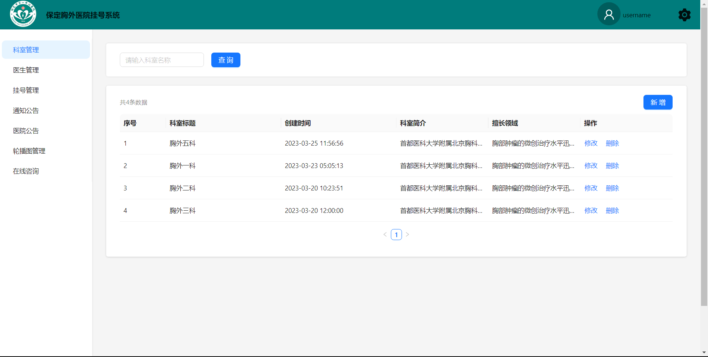
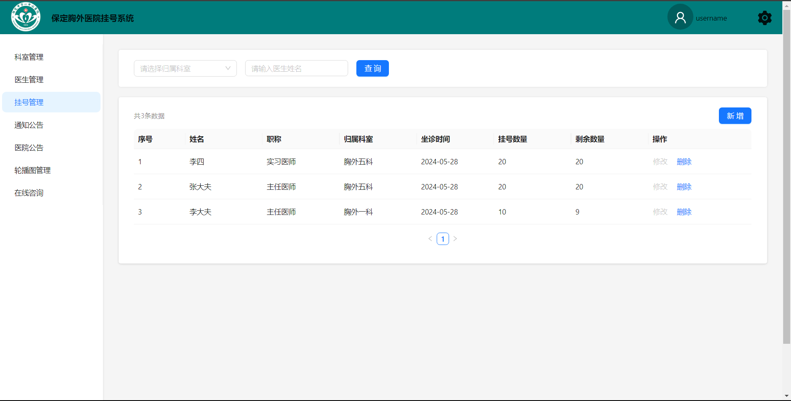

# 基于 React 的医院挂号系统的管理端

具有，每天晚上 6 点定时发送失约消息，在线交流 预约挂号 ，为他人预约，公告弹窗等功能

## 项目初始化

### `npm install`

## 用户端

[基于 React 的医院挂号系统的用户端](https://github.com/HZhertz/hospital-react-user)

## 后端接口

[基于 React 的医院挂号系统的后端接口](https://github.com/HZhertz/hospital-react-api)

## 效果图

